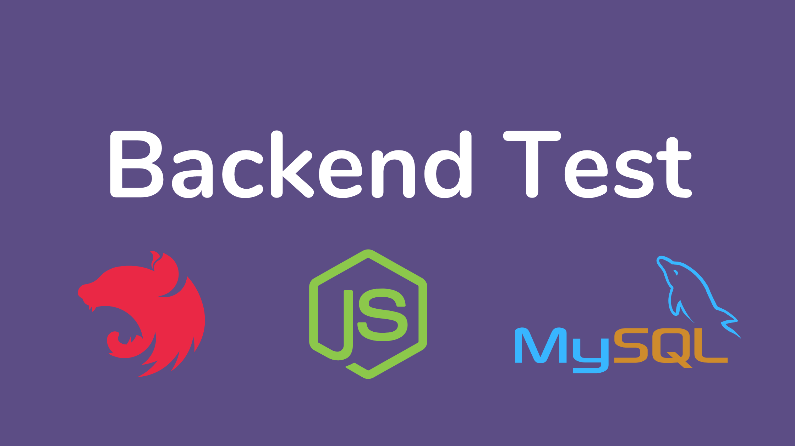

<h1 align="center">
  :rocket: Backend Test - NestJS
</h1>

  

  

  

  

  

  

  <a href="#rocket-tecnologias">Tecnologias</a>&nbsp;&nbsp;&nbsp;|&nbsp;&nbsp;&nbsp;
  <a href="#-descrição">Descrição</a>&nbsp;&nbsp;&nbsp;|&nbsp;&nbsp;&nbsp;
  <a href="#arrow_forward-como-rodar">Como rodar</a>&nbsp;&nbsp;&nbsp;|&nbsp;&nbsp;&nbsp;
  <a href="#memo-licença">Licença</a>

 

  

## :rocket: Tecnologias

Esse projeto foi desenvolvido com as seguintes tecnologias:

- [Nest.js](https://nestjs.com/) para criação da aplicação.
- [MySql](https://www.mysql.com/) para armazenamento dos dados.

## 📋 Descrição

Esse projeto é um serviço que faz a integração com uma loja [Shopify](https://www.shopify.com.br/) e permite os usuários favoritar e desfavoritar produtos. Os usuários também podem ver a sua lista de favoritos. Para isso o usuário deve se cadastrar e se autenticar no serviço.

[Documentação](https://github.com/goncadanilo/backend-test-nestjs/blob/develop/docs.md).

## :arrow_forward: Como rodar

Antes de tudo, instale as dependências do projeto com o seguinte comando `yarn` ou `npm install`. Também crie uma cópia do `.env.example` como `.env` e defina as variáveis de ambiente.

#### Node.js

- Execute as migration: `yarn typeorm migration:run`
- Para rodar a aplicação use o comando `yarn start` ou `npm run start`.
- Para rodar a aplicação em modo watch, use o comando `yarn start:dev` ou `npm run start:dev`.
- Se tudo ocorrer bem a aplicação vai estar disponível no endereço: **http://localhost:3000/v1/**.

#### Testes

- Para rodar os testes use o comando `yarn test` ou `npm run test`.
- Para rodar os testes e2e use o comando `yarn test:e2e` ou `npm run test:e2e`.
- Para rodar os testes com coverage, use o comando `yarn test:cov` ou `npm run test:cov`.

## :memo: Licença

Esse projeto está sob a licença MIT. Veja o arquivo [LICENSE](LICENSE.md) para mais detalhes.

---

Feito com ♥ by [Danilo Gonçalves](https://github.com/goncadanilo). Me adicione no [LinkedIn](https://www.linkedin.com/in/goncadanilo/) :wave:
